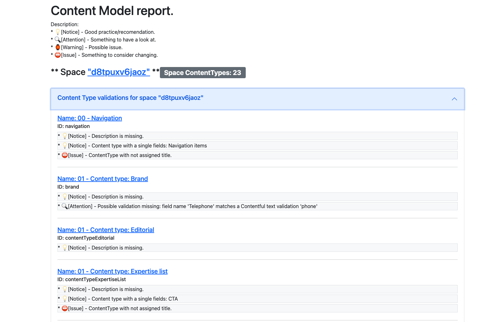
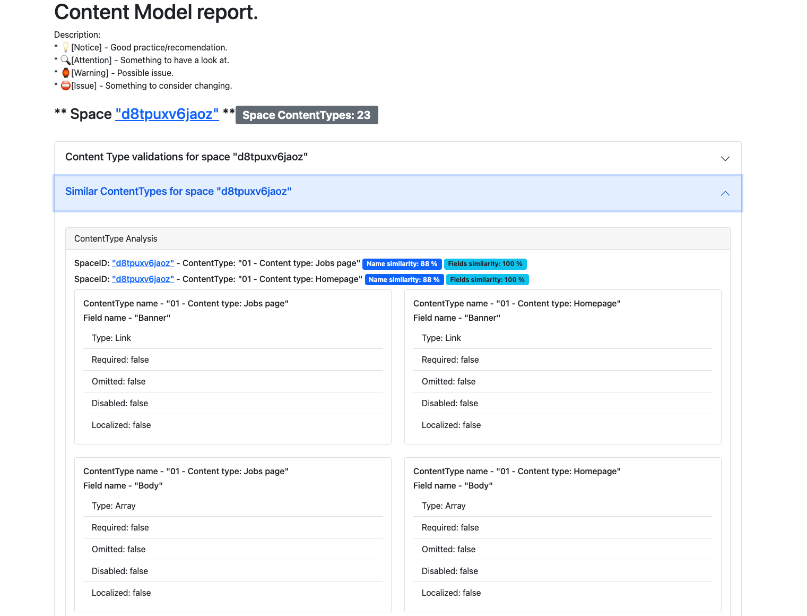
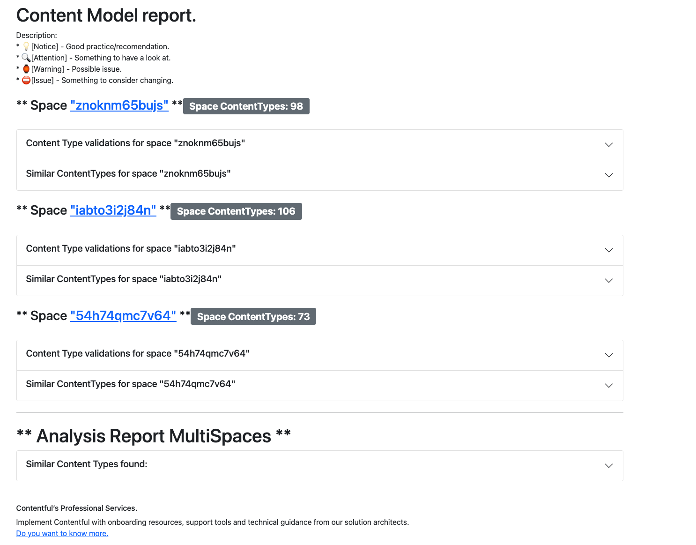

# Content type report
Script that anaylse the Content model JSON generated by CLI or CMA and present a report on content types.
Helpful tu identifz resubalitz in a multispace environment.

## How to use
### options
-f: Input a single content model as json, and output html report.

-d: parse a directory of json spaces and return a report on each space and multispace similitud.

#### Windows
- C:/contentAnalyser.exe -f some/file/contentFile.json
- C:/contentAnalyser.exe -d some/directory/
#### linux based 
- $ contentAnalyser -f some/file/contentFile.json
- $ contentAnalyser -d some/directory/

## Validations

### Similar types
  - Sequence matcher for content type naming, lower threshold set to 70 %
  - Similarity of types base on fields: Type, Required, Localized, Disabled and Omited

### ContentType and Fields validations
  - Look for validations based on fields names: "email","e-mail", "phone", "telephone", "mobile", "url", "link", "date""time"
  - Show broken references, when a reference field has links but ContentTypes do not exist

## Screnshoots

### Single report
#### Validations

#### Similitud

### Multispace

# references
https://github.com/pmezard/go-difflib/blob/v1.0.0/difflib/difflib_test.go